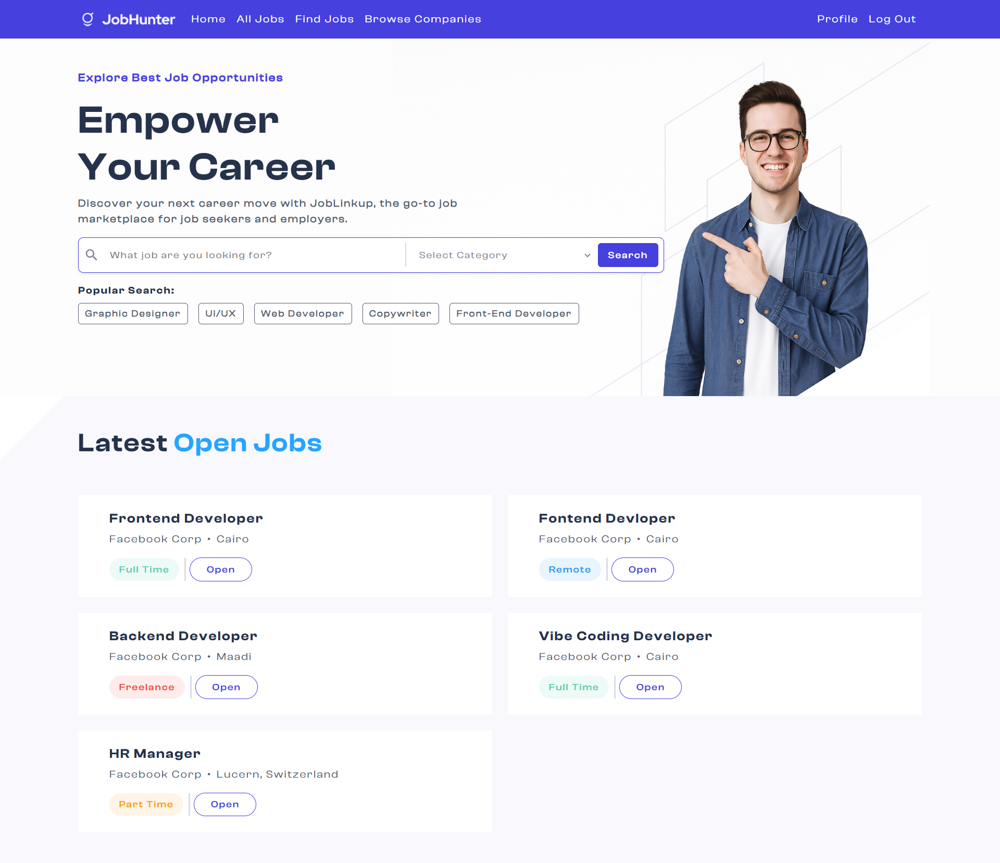
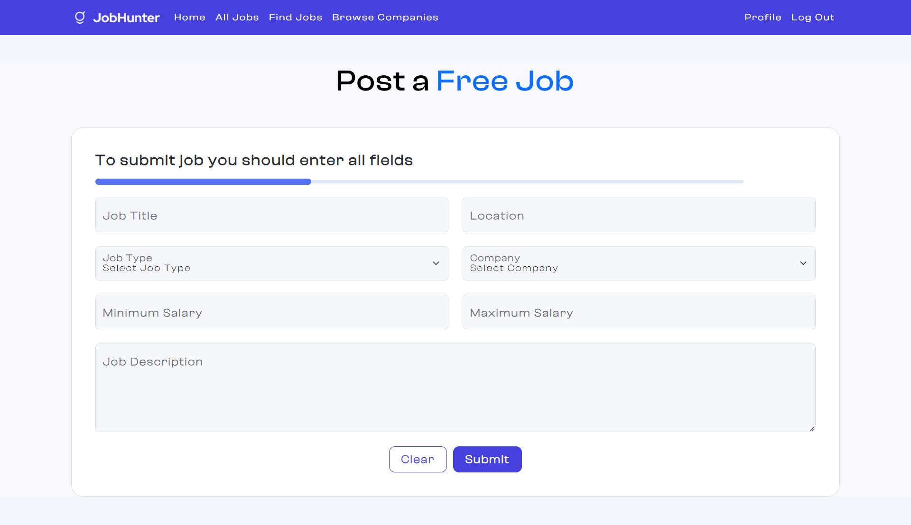

# 💼 Job Hunter | Job Board Platform (MERN)

A modern full-stack **Job Board Platform** built with **React** and **Node.js**, designed to connect job seekers with employers. Users can register, search for jobs, apply with resumes, while companies can post and manage listings.

It was developed as part of the **ITI Projects (2025)** during the **ITI ICC Training**.

---

## 📦 Project Modules

| App Name         | Description                                                              | GitHub Repository                                                               |
| ---------------- | ------------------------------------------------------------------------ | ------------------------------------------------------------------------------- |
| Web Application | React-based job board platform where users browse and apply to jobs      | [Frontend](https://github.com/MohamedAhIsmail/job-hunter-platform-react)                  |
| Backend API      | Node.js + Express API serving the platform with auth, jobs, applications | [Backend API](https://github.com/MohamedAhIsmail/job-hunter-platform-node) |

---

## 📸 Screenshots

  
  

---

## 🚀 Features

| Feature                      | Description                                                           |
|-----------------------------|-----------------------------------------------------------------------|
| 👤 User Authentication       | Sign up / Login with role-based access (Job Seeker & Employer)        |
| 📄 Resume Upload             | Job seekers can upload PDF resumes when applying                      |
| 🔍 Job Search & Filter       | Search jobs by title, category, and location                          |
| 📝 Job Applications          | Apply directly through the platform                                   |
| 🏢 Employer                  | Employers can create, update, and manage their job posts              |
| 🌙 Responsive UI             | Fully responsive for mobile and desktop                               |

---

## 🛠️ Tech Stack

| Layer       | Technology                      |
|-------------|----------------------------------|
| **Frontend** | React 19, Vite, Zustand, MUI, Bootstrap |
| **Forms**    | Formik + Yup                    |
| **Routing**  | React Router DOM v7             |
| **Backend**  | Node.js, Express                |
| **Database** | MongoDB + Mongoose              |
| **Auth**     | JWT, bcrypt                     |
| **Upload**   | Multer (for PDF resume uploads) |
| **API Client** | Axios                         |

---

## 👥 Our Team

| Name          | GitHub Profile                                         |
| ------------- | ------------------------------------------------------ |
| Mohamed Ahmed | [@MohamedAhIsmail](https://github.com/MohamedAhIsmail) |
| Malik Hussein | [@malikhussein](https://github.com/malikhussein)       |
| Ahmed Amr     | [@ahmedamr3000](https://github.com/ahmedamr3000)       |
| Mohamed Eid   | [@Mohamedeid602](https://github.com/Mohamedeid602)     |
| Omar Abdeen   | [@OmarAbdeen](https://github.com/Test0-VC)             |

---

## 📄 License

This project is open-source and available under the MIT License.

